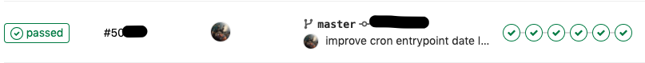
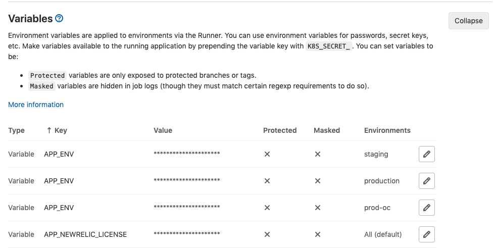

# Kubernetes collection

Collection of Kubernetes- and Helm-related snippets, commands and tools


### K8s

[Bash profile k8s helper](bin-k8s/bash_profile_k8s_helper.sh)
[Get Helm script](bin-k8s/get_helm.sh)

##### List all k8s resources in namespace

```shell script
kubectl api-resources --verbs=list --namespaced -o name | xargs -n 1 kubectl get --show-kind --ignore-not-found -n NAMESPACE
```

##### List all container images in namespace

```shell script
kubectl get pods -o jsonpath="{.items[*].spec.containers[*].image}" -n NAMESPACE | tr ' ' "\n" && echo ''
 
# group by images
kubectl get pods -n NAMESPACE -o jsonpath="{..image}" | tr -s '[[:space:]]' '\n' | sort | uniq -c
 
# group by pod
kubectl get pods -n NAMESPACE -o=jsonpath='{range .items[*]}{"\n"}{.metadata.name}{":\t"}{range .spec.containers[*]}{.image}{", "}{end}{end}' | sort
```

##### Run command at the first found pod container filtered by selector

```shell script
kubectl get pods -n NAMESPACE | grep FILTER | head -n 1 | awk '{print $1}' | xargs -I % kubectl exec -t -n NAMESPACE % CMD
```

##### Fetch logs by label cronjob, grep only container names

```shell script
k logs -lservice=SERVICENAME -n NAMESPACE --prefix=true | sed 's/\[\([^]]*\)].*/\1/' | grep -v -e '^$'
```

##### Service commands

Check for K8s time

```shell script
kubectl run -i --tty busybox --image=busybox --restart=Never -- date
```

Check for kubectl

```shell script
\command -v kubectl >/dev/null 2>&1 || {
  echo 'Oops, you have to install kubectl!' && exit 1;
}
```

Install Kail

```shell script
command -v kail >/dev/null 2>&1 || {
  brew tap boz/repo && brew install boz/repo/kail || exit 1;
}
```


# Helm

##### Install / upgrade release

```shell script
helm upgrade --install --force RELEASE_NAME helm/ -f helm/values.yaml -f helm/values-ENVIRONMENT_NAME.yaml --namespace NAMESPACE --set-string ENV_VARS \
  --dry-run
```

##### Rollback last release update

```shell script
helm rollback RELEASE_NAME 0
```

##### Delete release

```shell script
helm delete --purge RELEASE_NAME
```


# Gitlab CI

Here is examples how to build multi-cluster pipeline based on Gitlab CI.

Pipelines list:


Pipeline:


Variables common and per single environment:


##### Define steps and global variables

```yaml
# usually it's better to move templates to separate file
include:
  - local: '/ci/.gitlab-ci-templates.yml'

stages:
  - build
  - push
  - staging
  - after-staging
  - production
  - after-prod

image: docker:latest

services:
  - docker:dind

variables:
  CI_VAR_PROJECT: $APP_NAME
  # Possible Stati for the clusters: active, backup
  CI_PROD1_STATUS: backup
  CI_PROD2_STATUS: active
  CI_REGISTRY_URL: $REGISTRY_URL
  CI_REGISTRY_USER: $REGISTRY_USER
  CI_REGISTRY_PASSWORD: $REGISTRY_PASSWORD
  ...
```

##### Build

```yaml
build::nginx:
  extends: .build-template
  stage: build
  variables:
    T_SERVICE: nginx

.build-template:
  script:
    # Build image
    - docker build -t $CI_VAR_PROJECT-$T_SERVICE:prod docker/$T_SERVICE
    # Save image as an artifact
    - mkdir -p build/$T_SERVICE
    - docker save $CI_VAR_PROJECT-$T_SERVICE:prod -o build/$T_SERVICE/$T_SERVICE-prod.tar
  artifacts:
    name: $CI_JOB_NAME-$CI_COMMIT_SHORT_SHA
    expire_in: 1 day
    paths:
      - build/$T_SERVICE
  dependencies: []
```

##### Push

```yaml
push::nginx:
  extends: .push-template
  stage: push
  variables:
    T_SERVICE: nginx
  dependencies:
    - build::nginx

.push-template:
  before_script:
    # Load image from build stage
    - docker load -i build/$T_SERVICE/$T_SERVICE-prod.tar
  script:
    # Tag image
    - docker tag $CI_VAR_PROJECT-$T_SERVICE:prod $CI_REGISTRY_URL/$T_SERVICE:$CI_COMMIT_SHORT_SHA
    # Push image
    - docker login -u $CI_REGISTRY_USER -p $CI_REGISTRY_PASSWORD $CI_REGISTRY_URL
    - docker push $CI_REGISTRY_URL/$T_SERVICE:$CI_COMMIT_SHORT_SHA
  only:
    - master
    - web
```

##### E2e tests

```yaml
staging::e2e-tests:
  extends: .e2e-tests-template
  stage: after-staging
  variables:
    T_TEST_ENV: staging
    T_TEST_SUITE: full
    T_START_DELAY: 300
  retry: 2

prod::e2e-tests:
  extends: .e2e-tests-template
  stage: after-prod
  variables:
    T_TEST_ENV: prod
    T_TEST_SUITE: smoke
  retry: 2

.e2e-tests-template:
  image:
    name: postman/newman:alpine
    entrypoint: [""]
  script:
    - echo "Hey! Let's wait until pods are getting up for a ${T_START_DELAY} seconds"
    - sleep $T_START_DELAY
    - ./newman/run-e2e --env ${T_TEST_ENV} --suite ${T_TEST_SUITE}
  variables:
    T_START_DELAY: 60
  dependencies: []
  only:
    - master
    - web
```

##### Setup cluster

```yaml
staging::setup:
  extends: .setup-template
  stage: staging
  variables:
    T_ENV_TYPE: staging
    T_K8S_DC: fra
  environment:
    name: staging

.setup-template:
  image: deployer.azurecr.io/helm-${T_K8S_DC}:${T_ENV_TYPE}
  script:
    - >-
      kubectl get ns ${CI_VAR_PROJECT} || \
        kubectl create ns ${CI_VAR_PROJECT}
    - >-
      kubectl get secret pull-secret -n ${CI_VAR_PROJECT} || \
        kubectl create secret docker-registry pull-secret \
          --docker-server=${CI_REGISTRY_URL} \
          --docker-username=${CI_REGISTRY_USER} \
          --docker-password=${CI_REGISTRY_PASSWORD} \
          --docker-email=${T_DOCKER_DEV_EMAIL} \
          -n ${CI_VAR_PROJECT} \
          --dry-run -o yaml | \
        kubectl apply -f -
  variables:
    T_DOCKER_DEV_EMAIL: demmonico@gmail.com
  dependencies: []
  needs: []
  when: manual
```

##### Deploy

```yaml
prod1::_DEPLOY:
  extends: .deploy-template
  stage: production
  variables:
    T_K8S_DC: prod_1
    T_K8S_CLUSTER: $CI_PROD1_STATUS
    CI_NEWRELIC_APP_ID: $NEWRELIC_APP_ID
  environment:
    name: production
  when: manual

.deploy-template:
  image: deployer.azurecr.io/${T_K8S_DEPLOYER_DC_NAME}:${T_ENV_TYPE}
  before_script:
    # env vars
    - export HELM_ENV_STRING="$(./ci/prepare_helm_env_params.sh ${CI_COMMIT_SHORT_SHA} ${T_ENV_TYPE} ${T_K8S_DC})"
    # define registry and tag for images
    - export IMAGES_PARAMS_STRING="registry.url=$CI_REGISTRY_URL,registry.tag=$CI_COMMIT_SHORT_SHA"
    # define deployment env values
    - export DEPLOYMENT_ENV_STRING="deployment.dc=$T_K8S_DC,deployment.cluster=$T_K8S_CLUSTER,deployment.env=$T_ENV_TYPE"
    # helm values depends on env e.g. helm/<NAMESPACE>/values-staging.yaml OR helm/<NAMESPACE>/values-production-active.yaml
    - export HELM_ENV_VALUES_FILE="helm/${T_K8S_NAMESPACE}/values-${T_ENV_TYPE}${T_K8S_CLUSTER:+-$T_K8S_CLUSTER}.yaml"
    - |
      export HELM_LINT_CMD=" \
        helm lint helm/$T_K8S_NAMESPACE \
          -f $HELM_ENV_VALUES_FILE \
          --set-string ${HELM_ENV_STRING} \
          --set-string ${IMAGES_PARAMS_STRING} \
          --set-string ${DEPLOYMENT_ENV_STRING} \
          --namespace $T_K8S_NAMESPACE \
      "
    - |
      export HELM_UPGRADE_CMD=" \
        helm upgrade $T_K8S_NAMESPACE helm/$T_K8S_NAMESPACE --install --force \
          -f $HELM_ENV_VALUES_FILE \
          --set-string ${HELM_ENV_STRING} \
          --set-string ${IMAGES_PARAMS_STRING} \
          --set-string ${DEPLOYMENT_ENV_STRING} \
          --namespace $T_K8S_NAMESPACE \
      "
  script:
    - eval ${HELM_LINT_CMD}
    - eval ${HELM_UPGRADE_CMD}
    - kubectl get events --sort-by=.metadata.creationTimestamp -n $T_K8S_NAMESPACE | grep -vE "Pulling|Pulled|Created|Started" | tail || true
    - kubectl get svc,deploy,po,cronjobs -n $T_K8S_NAMESPACE
    - sh ./ci/notify_newrelic.sh "${GITLAB_USER_NAME} ${GITLAB_USER_EMAIL}" $CI_COMMIT_SHORT_SHA "${CI_COMMIT_MESSAGE}"
  variables:
    T_K8S_DEPLOYER_DC_NAME: helm-${T_K8S_DC}
    T_K8S_NAMESPACE: ${CI_VAR_PROJECT}
    # set default, not using $CI_ENVIRONMENT_SLUG cause we have 2 different production env vars, depends on clusters
    T_ENV_TYPE: production
  dependencies: []
  only:
    - master
```

##### Dry-run based on deploy

```yaml
prod1::_dry-run:
  extends: .deploy-dry-run-template
  stage: production
  variables:
    T_K8S_DC: prod_1
    T_K8S_CLUSTER: $CI_PROD1_STATUS

.deploy-dry-run-template:
  extends: .deploy-template
  script:
    - echo ${HELM_LINT_CMD}
    - echo ${HELM_UPGRADE_CMD}
    - eval ${HELM_LINT_CMD}
    - eval ${HELM_UPGRADE_CMD} --dry-run --debug
  needs: []
  when: manual
  only:
    - /.*/
```

##### Rollback Helm deploy

```yaml
prod1::rollback:
  extends: .rollback-template
  stage: production
  variables:
    T_ENV_TYPE: production
    T_K8S_DC: prod_1
  environment:
    name: production

.rollback-template:
  image: deployer.azurecr.io/${T_K8S_DEPLOYER_DC_NAME}:${T_ENV_TYPE}
  script:
    - helm rollback ${T_K8S_NAMESPACE} 0
  variables:
    T_K8S_DEPLOYER_DC_NAME: helm-${T_K8S_DC}
    T_K8S_NAMESPACE: ${CI_VAR_PROJECT}
  dependencies: []
  when: manual
  only:
    - master
```

##### Delete Helm release

```yaml
prod1::delete:
  extends: .delete-template
  stage: production
  variables:
    T_ENV_TYPE: production
    T_K8S_DC: prod_1
  environment:
    name: production

.delete-template:
  image: deployer.azurecr.io/${T_K8S_DEPLOYER_DC_NAME}:${T_ENV_TYPE}
  script:
    - helm delete --purge ${T_K8S_NAMESPACE}
  variables:
    T_K8S_DEPLOYER_DC_NAME: helm-${T_K8S_DC}
    T_K8S_NAMESPACE: ${CI_VAR_PROJECT}
  dependencies: []
  when: manual
  only:
    - master
```

##### Purge container registry

```yaml
registry-purge:
  extends: .registry-purge-template
  stage: after-prod
  script:
    # set up amount images to save at 50
    - ./ci/purge-registry.sh ${CI_REGISTRY_USER} php-fpm 50
    - ./ci/purge-registry.sh ${CI_REGISTRY_USER} nginx 50
    - ./ci/purge-registry.sh ${CI_REGISTRY_USER} redis 50
  when: manual

.registry-purge-template:
  image: mcr.microsoft.com/azure-cli:2.0.77
  before_script:
    - az login --service-principal -u ${CI_REGISTRY_PURGE_USER} -p ${CI_REGISTRY_PURGE_PASSWORD} -t ${CI_REGISTRY_PURGE_TENANT}
  dependencies: []
  only:
    - master
  tags:
    - azure
```